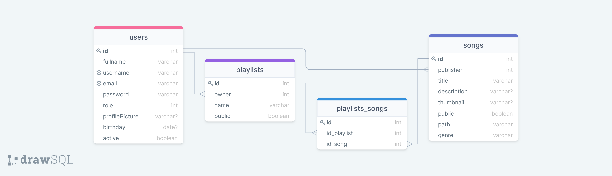

# MusicalEasy

Este sistema fue desarrollado haciendo uso de la **Arquitectura** `Modelo Vista Controlador (MVC)`.

El sistema fué desarrollado usando estas tecnologías:

* `HTML` y `CSS` a través del framework `TailwindCSS`.
* `NodeJS` para el backend a través del framework `Express`.
* `MySQL` para la base de datos.
* `Pug` para renderizar las vistas.
* `Javascript` para el frontend.
* La comunicación entre el cliente y el servidor se hizo usando `JSON` de manera asíncrona.

**Librerias empleadas en el lado del Servidor:**

* `bcrypt`
* `connect-flash`
* `dotenv`
* `express`
* `express-session`
* `morgan`
* `mysql2`
* `pug`

## Modelado del Problema

**Diagrama Entidad - Relación:**

